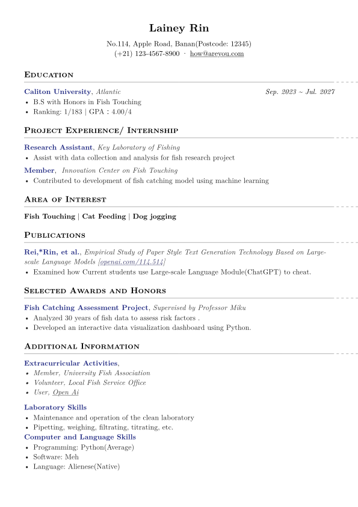

# typst_cv_template
A simple template for Typst.



## How to use

1. Copy the template(`CV_en_template.typ`) inside the `src` folder to your workspace.

Import one of the template inside your document.
```typst
#import "cv_template_en.typ": *
```
2. Configure the contents.
You can edit the contents below the `//// Preview ////` sign:
```typst
#show: doc => conf(
  name: "Lainey Rin",
  address: "No.114, Apple Road, Banan(Postcode: 12345)",
  phone: "(+21) 123-4567-8900",
  email: "how@areyou.com",
  doc,
)
```

3. Configure the styles.
Function `cv_block` is defined to construct the main content:
```typst
#let cv_block(//CV Content style
  name: none,
  date: none,
  entity: none,
  description: none,
  
) = par({
  heading(level: 2, name)
  if entity != none {
    ", "
    text(fill: luma(20%),style: "italic", entity)
  }
  h(1fr)
  text(style: "italic", date)
  v(1pt)
  text(fill: luma(12%),description)
})
```
Function `cv_link` is defined to carry links in the CV:
```typst
#let cv_link(
  url,
) = link("https://" + url, text(fill: rgb(20%, 20%, 40%), url))
```
